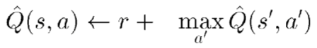

# Frozen Lake with RL

* [Frozen Lake with RL](https://github.com/lkm2835/reinforcement_learning/tree/master/frozen_lake#frozen-lake-with-rl)
  * [Usage](https://github.com/lkm2835/reinforcement_learning/tree/master/frozen_lake#usage)
    * [Config file format](https://github.com/lkm2835/reinforcement_learning/tree/master/frozen_lake#config-file-format)
    * [Using config files](https://github.com/lkm2835/reinforcement_learning/tree/master/frozen_lake#using-config-files)
    * [Another usage](https://github.com/lkm2835/reinforcement_learning/tree/master/frozen_lake#another-usage)
  * [Q Learning Method](https://github.com/lkm2835/reinforcement_learning/tree/master/frozen_lake#q-learning-method)
    * [Method 1](https://github.com/lkm2835/reinforcement_learning/tree/master/frozen_lake#method-1)
    * [Method 2](https://github.com/lkm2835/reinforcement_learning/tree/master/frozen_lake#method-2)
    * [Method 3](https://github.com/lkm2835/reinforcement_learning/tree/master/frozen_lake#method-3)

## Usage
Try `$ python main.py -c config.json` to run code.
### Config file format
``` 
{
    "fname": "config.json",  // config file name
    "default": true,         // use only config file
    "num_episodes": 2000,    // epoch
    "Q_learning_method": 3,  // how to learn reward
    "discounted": 0.9,       // parameter for Q_learning_method 2, 3
    "learning_rate": 0.2,    // parameter for Q_learning_method 3
    "slippery": true         // Frozen Lake option
}
```
Add addtional configurations if you need.


### Using config files
Modify the configurations in `.json` config files, then run:
```
$ python3 main.py -c config.json
```


### Another usage
Another usage without modifying config files
```
 $ python3 main.py -c config.json --learning_method 2 --episodes 3000 --discount_rate 0.5 --learning_rate 0.3 --slippery False
```


if you want, use a short.
```
 $ python3 main.py -c config.json -lm 2 -ep 3000 -dr 0.5 -lr 0.3 -sp N
```


---
## Q Learning Method

### Method 1
  
* use reward
<br>

### Method 2
  
* use discounted reward
<br>

### Method 3
  

* use discounted reward
* use learning rate

<br>
